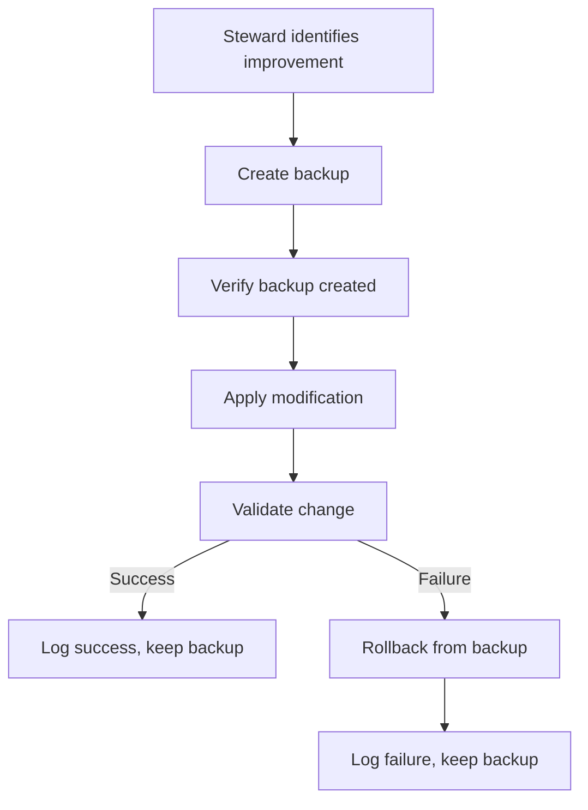

# Steward Backups

This directory contains backups created by the Steward Agent before making any modifications to files.

## Purpose

The Steward Agent follows a strict safety-first protocol:
1. **Backup Before Change**: Create timestamped backup of original file
2. **Apply Modification**: Make the intended change
3. **Validate**: Test that functionality is preserved
4. **Rollback if Failed**: Restore from backup if validation fails

This directory stores all those backups, providing a safety net for all automated improvements.

## Directory Structure

```
.steward-backups/
├── README.md (this file)
├── phase1/           # Backups from Phase 1 operations
├── phase2/           # Backups from Phase 2 operations
├── phase3/           # Backups from Phase 3 operations
└── [timestamp]/      # Additional timestamped backup directories
```

## Backup Naming Convention

Backups follow this naming pattern:

```
[filename].[extension].bak
```

**Examples**:
- `index.html.bak` - Backup of index.html
- `app.js.bak` - Backup of app.js
- `config.json.bak` - Backup of config.json

For phase-organized backups:
```
phase[N]/[filename].[extension]
```

**Examples**:
- `phase1/index.html` - Phase 1 backup of index.html
- `phase2/advanced-tools.html` - Phase 2 backup
- `phase3/pokemon-battle-assistant-v1.html` - Phase 3 backup

## Retention Policy

### Automatic Retention
- **Default**: Keep last 50 backups
- **Age Limit**: Auto-delete backups older than 30 days
- **Phase Backups**: Retained indefinitely for audit trail

### Manual Retention
You can manually clean up old backups:

```bash
# Remove backups older than 30 days
find .steward-backups -name "*.bak" -mtime +30 -delete

# Remove all non-phase backups
rm .steward-backups/*.bak

# Keep only phase backups
find .steward-backups -maxdepth 1 -type f -delete
```

## Restoring from Backup

### Manual Restoration

To restore a file from backup:

```bash
# Restore specific file
cp .steward-backups/phase3/index.html index.html

# Verify restoration
diff .steward-backups/phase3/index.html index.html
```

### Automated Rollback

The Steward Agent automatically rolls back on failure:

```python
try:
    # Apply improvement
    modify_file(path)

    # Validate
    if not validate(path):
        raise ValidationError("Tests failed")

except Exception as e:
    # Automatic rollback
    restore_backup(backup_path)
    log_failure(improvement, e)
```

## Backup Metadata

Each backup operation is logged in `.steward-reports/steward-log.jsonl`:

```json
{
  "timestamp": "2025-11-20T20:15:00Z",
  "operation": "file_move",
  "phase": "phase3",
  "originalFile": "advanced-tools.html",
  "backupFile": ".steward-backups/phase3/advanced-tools.html",
  "newLocation": "apps/development/advanced-tools.html",
  "status": "success",
  "validation": "passed"
}
```

## What Gets Backed Up

### Always Backed Up
- HTML files before modification
- Configuration files (JSON, YAML)
- Source code files
- Documentation files
- Any file being moved or modified

### Never Backed Up
- Generated files
- Temporary files
- Node modules
- Build artifacts
- Git repository files

## Safety Guarantees

### Before Every Change
1. ✅ Backup created in `.steward-backups/`
2. ✅ Backup verified (file copied successfully)
3. ✅ Original file checksum recorded
4. ✅ Backup path logged

### After Every Change
1. ✅ Modification applied
2. ✅ Validation performed
3. ✅ Success/failure logged
4. ✅ Rollback on failure

### Rollback Conditions
Automatic rollback occurs when:
- Validation tests fail
- File becomes corrupted
- Syntax errors detected
- Functionality breaks
- Manual rollback requested

## Phase-Specific Backups

### Phase 1: Initial Organization
**Backed Up**:
- Files before directory creation
- Configuration files before modification
- Any files that were moved

### Phase 2: Intermediate Cleanup
**Backed Up**:
- Files before reorganization
- Updated configurations
- Modified documentation

### Phase 3: Final Organization
**Backed Up**:
- All HTML files before moving
- README files before creation/modification
- Configuration updates

## Backup Verification

To verify backup integrity:

```bash
# Check if backup exists
ls -lh .steward-backups/phase3/

# Compare backup to current file
diff .steward-backups/phase3/index.html apps/development/index.html

# Verify backup is readable
file .steward-backups/phase3/*.html
```

## Storage Considerations

### File Size
- Backups are exact copies (same size as original)
- Phase 3 backups: ~2.8MB total
- All phases combined: ~10-15MB typical

### Disk Space
Monitor backup directory size:

```bash
# Check total size
du -sh .steward-backups/

# Check per-phase size
du -sh .steward-backups/phase*/

# List largest backups
du -h .steward-backups/* | sort -hr | head -10
```

## Cleanup Recommendations

### When to Clean Up

**Safe to Remove**:
- Backups older than 30 days (if changes validated)
- Duplicate backups from same operation
- Backups of files that no longer exist

**Keep**:
- Phase backups (audit trail)
- Recent backups (last 7 days)
- Backups of critical files
- Backups before major changes

### Cleanup Script

```bash
#!/bin/bash
# cleanup-old-backups.sh

# Remove backups older than 30 days (except phase backups)
find .steward-backups -maxdepth 1 -name "*.bak" -mtime +30 -delete

# Keep only last 50 non-phase backups
cd .steward-backups
ls -t *.bak 2>/dev/null | tail -n +51 | xargs rm -f

echo "Cleanup complete. Phase backups retained."
```

## Audit Trail

### Why Keep Phase Backups?

Phase backups provide an audit trail showing:
- What the project looked like before stewardship
- What changed in each phase
- Complete history of modifications
- Ability to trace any issue back to source

### Audit Use Cases
1. **Debugging**: Compare current state to any previous phase
2. **Compliance**: Show what changed and when
3. **Learning**: Study how the project evolved
4. **Rollback**: Restore entire project to any phase

## Emergency Restoration

### Full Project Rollback

To restore entire project to Phase 1:

```bash
# 1. Identify all Phase 3 backups
ls .steward-backups/phase3/

# 2. Restore each file
for file in .steward-backups/phase3/*.html; do
  basename=$(basename "$file")
  cp "$file" "./$basename"
done

# 3. Verify restoration
git status  # Shows all restored files as modified
```

### Selective Restoration

To restore specific files:

```bash
# Restore single file
cp .steward-backups/phase3/pokemon-battle-assistant-v1.html .

# Restore multiple files matching pattern
cp .steward-backups/phase3/pokemon-*.html .

# Restore with confirmation
for file in .steward-backups/phase3/pokemon-*.html; do
  echo "Restore $(basename $file)? (y/n)"
  read answer
  if [ "$answer" = "y" ]; then
    cp "$file" .
  fi
done
```

## Integration with Steward

### Backup Creation Flow



### Backup Lifecycle

1. **Created**: Before any modification
2. **Validated**: After creation (file exists, readable)
3. **Referenced**: During modification (path stored)
4. **Used**: If rollback needed
5. **Retained**: For audit trail
6. **Cleaned**: After retention period (optional)

## Best Practices

### For Users
1. Don't manually delete phase backups (audit trail)
2. Verify backups exist before deleting originals
3. Test restorations periodically
4. Keep backups of critical files indefinitely
5. Monitor disk space usage

### For Steward
1. Always backup before any change
2. Verify backup creation success
3. Log all backup operations
4. Include backup path in all logs
5. Never delete backups automatically during operations

## Troubleshooting

### Backup Failed to Create

**Symptoms**: Error message about backup creation
**Causes**:
- Insufficient disk space
- Permission issues
- Backup directory doesn't exist

**Solutions**:
```bash
# Check disk space
df -h .

# Check permissions
ls -ld .steward-backups/

# Create backup directory if missing
mkdir -p .steward-backups/phase3/

# Fix permissions
chmod 755 .steward-backups/
```

### Cannot Restore Backup

**Symptoms**: cp command fails or restored file corrupted
**Causes**:
- Backup file corrupted
- Permission issues
- Wrong file path

**Solutions**:
```bash
# Verify backup exists
ls -lh .steward-backups/phase3/file.html

# Check backup is valid
file .steward-backups/phase3/file.html

# Verify permissions
ls -l .steward-backups/phase3/file.html

# Try different copy method
cat .steward-backups/phase3/file.html > file.html
```

## Future Enhancements

Planned improvements:
- Compressed backups (.gz) to save space
- Incremental backups (only store diffs)
- Backup versioning with timestamps
- Automated backup verification
- Backup health monitoring
- Cloud backup integration
- Backup encryption for sensitive files

## Support

For backup-related issues:
- Check `.steward-reports/steward-log.jsonl` for backup logs
- Verify backup directory permissions
- Ensure sufficient disk space
- Review phase reports for backup details

---

**Your safety net for confident automated improvements!**
